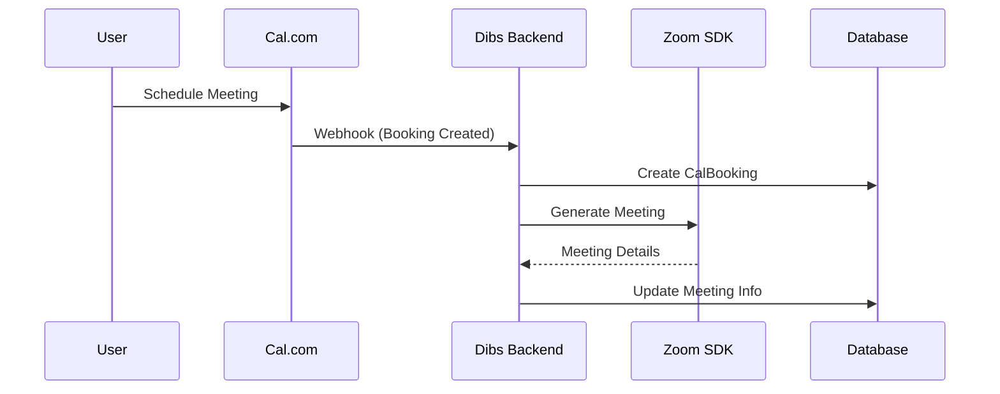

# Dibs Calendar & Zoom SDK Integration Technical Documentation

## Overview
This document details the integration between Cal.com's booking system and Zoom SDK for embedded video meetings within the Dibs platform. The system handles both 1:1 and group coaching sessions through an embedded video interface.

## Table of Contents
1. [Database Schema](#database-schema)
2. [System Architecture](#system-architecture)
3. [Integration Flows](#integration-flows)
4. [Security Considerations](#security-considerations)
5. [Implementation Guidelines](#implementation-guidelines)
6. [Error Handling](#error-handling)
7. [Future Considerations](#future-considerations)

## Database Schema

SEE LINE 272-372

## System Architecture

### Components

1. **Booking Management**
   - Handles Cal.com integration
   - Manages scheduling and calendar sync
   - Processes booking creation and updates

2. **Zoom SDK Integration**
   - Manages embedded video meetings
   - Handles participant authentication
   - Controls meeting lifecycle

3. **Session Management**
   - Tracks meeting status
   - Manages participant states
   - Handles recordings and analytics

### Data Flow



## Integration Flows

### 1. Booking Creation

```typescript
interface BookingCreationFlow {
  // Cal.com webhook handler
  async function handleCalWebhook(webhookData: CalWebhookPayload) {
    // 1. Validate webhook data
    // 2. Create booking record
    // 3. Generate Zoom meeting
    // 4. Send notifications
  }

  // Zoom meeting generation
  async function generateZoomMeeting(booking: CalBooking, coach: CoachZoomConfig) {
    // 1. Generate SDK signature
    // 2. Create meeting configuration
    // 3. Update booking with Zoom details
  }
}
```

### 2. Meeting Join Flow

```typescript
interface MeetingJoinFlow {
  // Generate participant tokens
  async function generateParticipantToken(bookingId: string, email: string) {
    // 1. Validate participant
    // 2. Generate session token
    // 3. Create Zoom signature
    // 4. Update participant status
  }

  // Meeting room initialization
  async function initializeMeetingRoom(config: ZoomConfig) {
    // 1. Load SDK
    // 2. Configure meeting
    // 3. Handle join events
  }
}
```

## Security Considerations

### 1. Authentication & Authorization
- Secure storage of Zoom credentials
- Participant validation
- Session token management

### 2. Data Protection
```typescript
interface SecurityMeasures {
  // Encrypt sensitive data
  function encryptZoomCredentials(credentials: ZoomCredentials): string;
  
  // Validate session tokens
  function validateSessionToken(token: string): boolean;
  
  // Generate secure signatures
  function generateMeetingSignature(config: SignatureConfig): string;
}
```

### 3. Meeting Security
- Waiting room functionality
- Host controls
- Recording permissions

## Implementation Guidelines

### 1. Meeting Room Component

```typescript
// React component for embedded meeting
const MeetingRoom: React.FC<MeetingProps> = ({ bookingId, participant }) => {
  // Component implementation
};

// Meeting controls
const MeetingControls: React.FC<ControlProps> = ({ meeting }) => {
  // Controls implementation
};
```

### 2. State Management

```typescript
interface MeetingState {
  status: MeetingStatus;
  participants: Participant[];
  recording?: RecordingStatus;
}

// State update handlers
const meetingStateHandlers = {
  handleParticipantJoin,
  handleParticipantLeave,
  handleRecordingState,
  handleMeetingEnd
};
```

### 3. Event Handling

```typescript
interface ZoomEventHandlers {
  onMeetingJoin: (meetingData: MeetingJoinData) => void;
  onParticipantUpdate: (participantData: ParticipantData) => void;
  onMeetingEnd: (endData: MeetingEndData) => void;
  onError: (error: ZoomError) => void;
}
```

## Error Handling

### 1. Common Errors
- Connection issues
- Authentication failures
- SDK initialization errors

### 2. Error Recovery
```typescript
interface ErrorRecovery {
  // Attempt to reconnect
  async function handleConnectionLoss(meeting: Meeting): Promise<void>;
  
  // Reinitialize SDK
  async function reinitializeSDK(config: ZoomConfig): Promise<void>;
}
```

## Future Considerations

### 1. Scalability
- Dynamic meeting generation
- Load balancing
- Resource optimization

### 2. Feature Enhancements
- Advanced recording management
- Analytics integration
- Custom meeting layouts

### 3. Integration Expansion
- Additional calendar providers
- Alternative video platforms
- Enhanced scheduling features

## API Reference

### 1. Booking Management
```typescript
interface BookingAPI {
  createBooking(data: BookingData): Promise<Booking>;
  updateBooking(id: string, data: Partial<BookingData>): Promise<Booking>;
  cancelBooking(id: string, reason?: string): Promise<void>;
}
```

### 2. Meeting Management
```typescript
interface MeetingAPI {
  createMeeting(bookingId: string): Promise<Meeting>;
  generateParticipantToken(bookingId: string, email: string): Promise<Token>;
  updateMeetingStatus(meetingId: string, status: MeetingStatus): Promise<void>;
}
```

## Testing Guidelines

### 1. Unit Tests
- Booking creation
- Token generation
- Security validation

### 2. Integration Tests
- Cal.com webhook handling
- Zoom SDK integration
- State management

### 3. End-to-End Tests
- Complete booking flow
- Meeting lifecycle
- Error scenarios

## Deployment Considerations

### 1. Environment Setup
- SDK configuration
- Credential management
- Environment variables

### 2. Monitoring
- Meeting metrics
- Error tracking
- Performance monitoring

## Support and Maintenance

### 1. Troubleshooting
- Common issues
- Debug procedures
- Support escalation

### 2. Updates and Maintenance
- SDK version management
- Database migrations
- Feature updates

---

This documentation serves as a comprehensive guide for implementing and maintaining the Cal.com and Zoom SDK integration within the Dibs platform. Regular updates should be made to reflect system changes and improvements.


Additional Schema details:

// Add this enum if not already present
enum CalBookingType {
  ONE_ON_ONE
  GROUP
}

model CalBooking {
  ulid                   String         @id @db.Char(26)
  userUlid              String         @db.Char(26)  // The coach's ULID
  calBookingUid         String         @unique
  calBookingId          Int?
  title                 String
  description           String?
  
  // Event Type Information
  eventTypeId           Int?
  eventTypeSlug         String?
  bookingType           CalBookingType @default(ONE_ON_ONE)
  maxParticipants       Int?           // For group sessions
  currentParticipants   Int            @default(1)   // Track current number of participants
  
  // Timing
  startTime            DateTime        @db.Timestamptz(6)
  endTime              DateTime        @db.Timestamptz(6)
  duration             Int?            // in minutes
  
  // Virtual Meeting Details
  zoomHostUrl          String?         // Coach's private host URL
  zoomJoinUrl          String?         // Attendee join URL
  zoomMeetingId        String?         // Zoom meeting ID for reference
  zoomPasscode         String?         // Meeting passcode if required
  customValidationToken String?        // For custom validation logic
  
  // Attendee Information (Primary Attendee)
  attendeeEmail        String          // Primary attendee email
  attendeeName         String?         // Primary attendee name
  attendeeTimeZone     String?
  
  // Group Session Participants (including primary attendee)
  participants         Json?           @default("[]") // Array of participant details
  /* Example participants structure:
    [{
      email: string,
      name: string,
      timeZone: string,
      joinUrl: string?,
      validationToken: string?,
      status: "CONFIRMED" | "CANCELLED" | "ATTENDED"
    }]
  */
  
  // Status and Reasons
  status               String         @default("CONFIRMED")
  cancellationReason   String?
  cancelledByEmail     String?
  reschedulingReason   String?
  rescheduledByEmail   String?
  rescheduledFromUid   String?
  
  // Additional Data
  bookingFields        Json?          @default("{}")
  metadata             Json?          @default("{}")
  rating               Int?
  
  // Timestamps
  createdAt           DateTime        @default(now()) @db.Timestamptz(6)
  updatedAt           DateTime        @updatedAt @db.Timestamptz(6)
  
  // Relations
  user                User           @relation(fields: [userUlid], references: [ulid], onDelete: Cascade)
  sessionUlid         String?        @unique @db.Char(26)
  session             Session?       @relation(fields: [sessionUlid], references: [ulid])

  @@index([userUlid])
  @@index([status])
  @@index([startTime])
  @@index([eventTypeId])
  @@index([calBookingUid])
  @@index([bookingType])
  @@map("CalBooking")
}

// Add this model to store coach's Zoom configuration
model CoachZoomConfig {
  ulid              String    @id @db.Char(26)
  userUlid          String    @unique @db.Char(26)  // Coach's ULID
  zoomUserId        String?   // Zoom user ID
  personalMeetingId String?   // PMI if using personal meeting room
  defaultHostUrl    String?   // Static host URL for now
  defaultJoinUrl    String?   // Static join URL for now
  isCustomUrl       Boolean   @default(false)  // Flag for static vs dynamic URLs
  settings          Json?     @default("{}")   // Additional Zoom settings
  createdAt         DateTime  @default(now()) @db.Timestamptz(6)
  updatedAt         DateTime  @updatedAt @db.Timestamptz(6)
  user              User      @relation(fields: [userUlid], references: [ulid], onDelete: Cascade)

  @@index([userUlid])
  @@map("CoachZoomConfig")
}